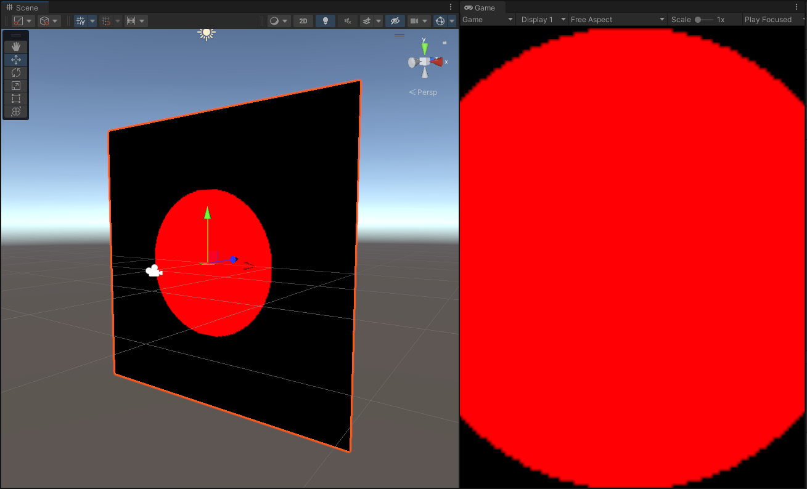
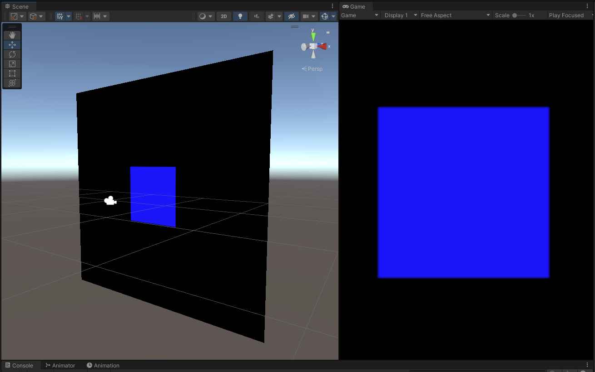
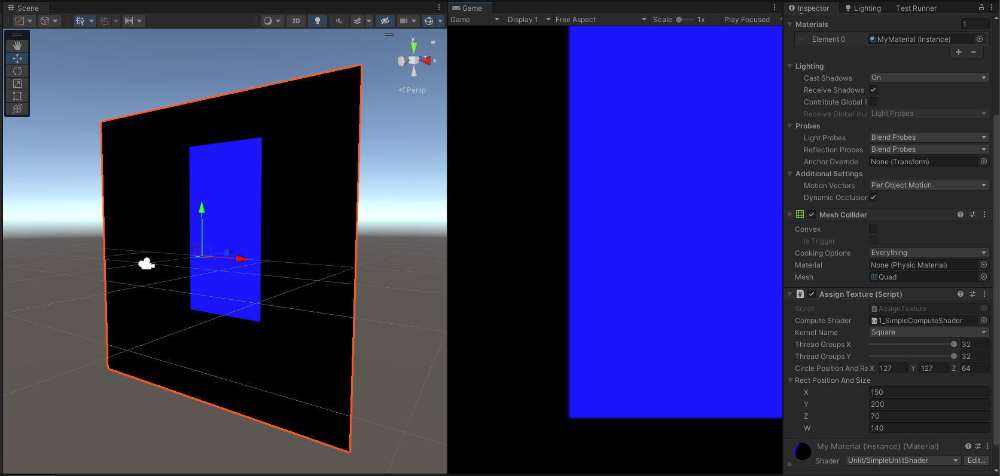
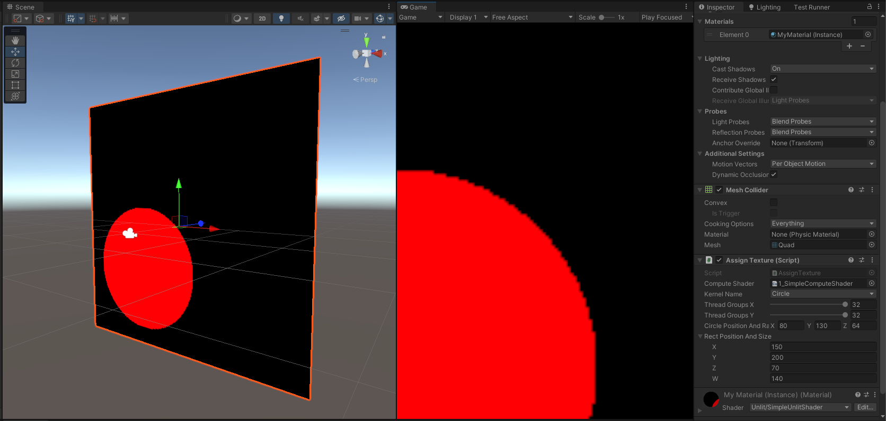
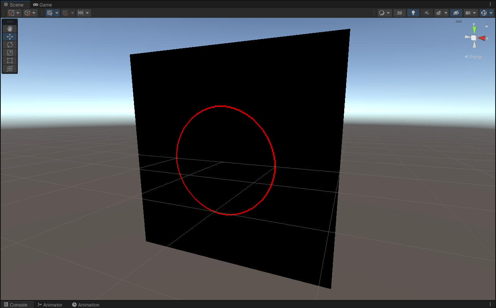

# Bubbles Compute Shader

Written in HLSL in **Unity 2021.3.10f1**

## Screenshots

<!-- 10.mp4 -->

https://user-images.githubusercontent.com/4588601/198105793-7c92d31f-57f7-48f3-9c30-8895f1fa915c.mp4

### References

- [Compute Shaders course by Nik Lever](https://www.udemy.com/course/compute-shaders)
- [Bresenham's Circle Drawing Algorithm](https://www.geeksforgeeks.org/bresenhams-circle-drawing-algorithm/)
- [Bresenham's Circle](https://arcade.makecode.com/graphics-math/bresenham-circle)

## Sections

- [Definition of the Compute Shader](#definition-of-the-compute-shader)
- [Dispatching the Compute Shader](#dispatching-the-compute-shader)
  - [Render Texture](#render-texture)
  - [Renderer](#renderer)
  - [Kernel Index](#kernel-index)
  - [Texture Assignment](#texture-assignment)
  - [Dispatching](#dispatching)
- [Multiple Kernels](#multiple-kernels)
- [Using Group ID and Thread ID](#using-group-id-and-thread-id)
  - [Painting each quadrant with a different color](#painting-each-quadrant-with-a-different-color)
  - [Circle](#circle)
  - [Square](#square)
- [Passing values to the Compute Shader](#passing-values-to-the-compute-shader)
- [Bubbles](#bubbles)
  - [Draw a Circle](#draw-a-circle)
  - [Share Texture between Kernels](#share-texture-between-kernels)
  - [Randomness](#randomness)
- [ComputeBuffer and StructuredBuffer](#computebuffer-and-structuredbuffer)
  - [CPU Side](#cpu-side)
  - [GPU Side](#gpu-side)

## Definition of the Compute Shader

- The **#pragma** declaration lets the compiler know the function name associated with the kernel definition.
- A Texture 2D buffer is defined as the result of the computation by declaring the `RWTexture2D<float4> Result`.
- `[numthreads(8,8,1)]` specifies that the thread group will have 8x8x1 number of threads, each working on a pixel on parallel.
  - We use 1 for the z dimension, because we don't need 3D depth.
  - 8x8 will be the size of the square of pixels handled by this thread group.
  - On a **256x256** pixel texture, we need **32x32x1** thread groups, each covering **8x8x1** pixels. All this will be parallelized.

```hlsl
// Each #kernel tells which function to compile; you can have many kernels
#pragma kernel CSMain

// Create a RenderTexture with enableRandomWrite flag and set it
// with cs.SetTexture
RWTexture2D<float4> Result;

[numthreads(8,8,1)]
void CSMain (uint3 id : SV_DispatchThreadID)
{
    Result[id.xy] = float4(1, 0, 0, 0);
}
```

## Dispatching the Compute Shader

### Render Texture

- Create a **Render Texture** object, which will act as the output of the **Compute Shader** computation.

```cs
int TEXTURE_RESOLUTION = 256;

// initialize the texture with just x and y dimensions, it could have z depth
_renderTexture = new RenderTexture(TEXTURE_RESOLUTION, TEXTURE_RESOLUTION, 0);

// allow the compute shader to write to the texture
_renderTexture.enableRandomWrite = true;

// RenderTexture constructor does not actually create the hardware texture
// https://docs.unity3d.com/ScriptReference/RenderTexture.Create.html
_renderTexture.Create();
```

### Renderer

- Get a hold of the current **Renderer** of the game object's mesh.

```cs
_renderer = GetComponent<Renderer>();
_renderer.enabled = true;
```

### Kernel Index

- Get a reference to the **kernel** id from the **Compute Shader**, which corresponds to the main function being executed.

```cs
// get a reference to the kernel defined in the #pragma inside the compute shader
_kernelIndex = computeShader.FindKernel("CSMain");
```

### Texture Assignment

- Assign the **Render Texture** to the **Compute Shader**, so that it can write to it.
- Assign the **Render Texture** to the **Material** in the renderer, so it can use it.

```cs
// set the texture to the compute shader, so it can write to it
computeShader.SetTexture(_kernelIndex, "Result", _renderTexture);

// set the texture to the material, so it can use the texture
_renderer.material.SetTexture("_MainTex", _renderTexture);
```

### Dispatching

- Our compute shader has **numthreads(8,8,1)** per each thread group.
- That means it will compute a square of 8x8x1 pixels or threads, per each thread group.
- **Dispatch()** takes in the amount of thread groups it should have in all 3 dimensions.
- 32 thread groups means 32 \* 8 = 256 pixels, that covers the whole texture.

```cs
// dispatches the kernel with the amount of thread groups = x * y * 1
// we keep z = 1 because we are working on a 2D texture, no need for depth
computeShader.Dispatch(_kernelIndex, x, y, 1);
```

<!-- 1.mp4 -->

https://user-images.githubusercontent.com/4588601/197791116-834b7201-975e-4280-89fb-c26432eb9b5b.mp4

## Multiple Kernels

- The **Compute Shader** can have more than one **#pragma** declaration to define kernels.
- Then in the C# code, a reference to each **kernel** can be kept and used separately.

```c
// Each #kernel tells which function to compile; you can have many kernels
#pragma kernel SolidRed
#pragma kernel SolidYellow

[numthreads(8,8,1)]
void SolidRed (uint3 id : SV_DispatchThreadID)
{
    Result[id.xy] = float4(1, 0, 0, 1);
}

[numthreads(8,8,1)]
void SolidYellow (uint3 id : SV_DispatchThreadID)
{
    Result[id.xy] = float4(1, 1, 0, 1);
}
```

<!-- 2.mp4 -->

https://user-images.githubusercontent.com/4588601/197801280-3977400e-b9eb-470c-9e31-303aa82918fa.mp4

## Using Group ID and Thread ID

- When the **Compute Shader** is dispatched, we indicate how many thread groups there will be, **32x32** thread groups mean **32** in each axis.
- Given the **numthreads(8,8,1)**, each thread will handle **8x8** pixels of the total **256x256** pixels of the texture.
- If we are in the **thread group id (1,2,0)** and in the **thread id (3,4,0)**, that means we will be in the pixel given by **(1,2,0) \* (8,8,1) + (3,4,0) = (1\*8 + 3, 2\*8 + 4, 0\*1 + 0)**, which is pixel **(11, 20, 0)**.

### Painting each quadrant with a different color

- The following code makes each quadrant be:
  - **Left-Bottom** quadrant will be **black**.
  - **Left-Top** quadrant will be **green**.
  - **Right-Top** quadrant will be **yellow**.
  - **Right-Bottom** quadrant will be **red**.

```c
[numthreads(8,8,1)]
void SplitScreen (uint3 id : SV_DispatchThreadID)
{
    float halfTextureSize = TextureResolution / 2;

    float4 green = float4(0, 1, 0, 1) * step(halfTextureSize, id.y);
    float4 red = float4(1, 0, 0, 1) * step(halfTextureSize, id.x);

    Result[id.xy] = green + red;
}
```

<!-- 3.mp4 -->

https://user-images.githubusercontent.com/4588601/197843481-7bda9e1b-7f7c-4e62-b912-acd9810b9cf9.mp4

### Circle

- Paint with red only pixels that are inside the circle.

```c
[numthreads(8,8,1)]
void Circle (uint3 id : SV_DispatchThreadID)
{
    float desiredRadius = CirclePositionAndRadius.z;
    float center = CirclePositionAndRadius.xy;
    float distanceToCenter = length(id.xy - center);

    float isInCircle = 1 - step(desiredRadius, distanceToCenter);

    Result[id.xy] = float4(1, 0, 0, 1) * isInCircle;
}
```



### Square

- Paint with red only pixels that are inside the square.

```c
[numthreads(8,8,1)]
void Square (uint3 id : SV_DispatchThreadID)
{
    float center = RectPositionAndSize.xy;
    float width = RectPositionAndSize.z;
    float height = RectPositionAndSize.w;
    float halfWidth = width / 2;
    float halfHeight = height / 2;

    float isInRectX = step(center - halfWidth, id.x) - step(center + halfWidth, id.x);
    float isInRectY = step(center - halfHeight, id.y) - step(center + halfHeight, id.y);
    float isInRect = isInRectX * isInRectY;

    Result[id.xy] = float4(0, 0, 1, 1) * isInRect;
}
```



## Passing values to the Compute Shader

- Values can be passed from **C#** into the **HLSL** code.

> MyScript.cs

```cs
private const int TEXTURE_RESOLUTION = 256;

public Vector3 CirclePositionAndRadius = new Vector3(0, 0, 64);
public Vector4 RectPositionAndSize = new Vector4(0, 0, 64, 64);

private RenderTexture _renderTexture;
```

```cs
// set the texture to the compute shader, so it can write to it
computeShader.SetTexture(_kernelIndex, "Result", _renderTexture);
computeShader.SetInt("TextureResolution", TEXTURE_RESOLUTION);
computeShader.SetVector("CirclePositionAndRadius", CirclePositionAndRadius);
computeShader.SetVector("RectPositionAndSize", RectPositionAndSize);
```

> MyCompureShader.compute

```c
RWTexture2D<float4> Result;
int TextureResolution;
float3 CirclePositionAndRadius;
float4 RectPositionAndSize;
```




## Bubbles

### Draw a Circle

- Using the **Bresenham's Circle Algorithm** draw a circle in the texture, using a **single** thread group with a **single** thread.

- [Bresenham's Circle Drawing Algorithm](https://www.geeksforgeeks.org/bresenhams-circle-drawing-algorithm/)
- [Bresenham's Circle](https://arcade.makecode.com/graphics-math/bresenham-circle)

```c
// Function for circle-generation using Bresenham's algorithm
void drawCircle(uint2 center, uint radius, float4 color, RWTexture2D<float4> output)
{
    int2 pixel = int2(0, radius);

    // circle equation is:
    // X^2 + Y^2 = RADIUS^2
    //
    // error equation for the two possible pixels:
    // A = (Xi + 1)^2 + Yi^2 - radius^2
    // B = (Xi + 1)^2 + (Yi - 1)^2 - radius^2
    //
    // d = 2 * (Xi + 1)^2 + Yi^2 + (Yi - 1)^2 - 2 * radius^2

    // when x=0 and y=radius
    int d = 3 - 2 * radius;

    drawMirroredPixels(center, pixel, color, output);

    while (pixel.y >= pixel.x)
    {
        // for each pixel we will draw all eight pixels
        pixel.x++;

        // check for decision parameter and correspondingly update d, x, y

        // the decision parameter is updated according to the equation:
        // Dj = Di + (expression for Dj) - (expression for Di)
        if (d > 0)
        {
            pixel.y--;
            // Di > 0: Dj = Di + 4 * (Xi - Yi) + 10
            d = d + 4 * (pixel.x - pixel.y) + 10;
        }
        else
        {
            // Di <= 0: Dj = Di + 4 * Xi + 6
            d = d + 4 * pixel.x + 6;
        }

        drawMirroredPixels(center, pixel, color, output);
    }
}
```



### Share Texture between Kernels

- The same texture can be shared between kernels.

> MyComputeShader.compute

```c
shared RWTexture2D<float4> Result;
```

> MyScript.cs

```cs
computeShader.SetTexture(_kernelIndexesA, "Result", _renderTexture);
computeShader.SetTexture(_kernelIndexesB, "Result", _renderTexture);
```

```cs
// paint the background with 32x32x1 x 8x1x1 threads
DispatchShader(_kernelIndexes[0], 32, 32);
// paint a bubble with 1x1x1 threads
DispatchShader(_kernelIndexes[1], THREAD_GROUP_COUNT, THREAD_GROUP_COUNT);
```

### Randomness

- The `Time` variable can be passed down to the compute shader.

> MyComputeShader.compute

```c
float Time;
```

```c
[numthreads(8,1,1)]
void RandomBubbles (uint3 id : SV_DispatchThreadID)
{
    float value = id.x + Time;
    float2 position = random2(value) * TextureResolution;
    float2 radius = random(value) * CirclePositionAndRadius.z;
    drawCircle(position, radius, CircleColor, Result);
}
```

> MyScript.cs

```cs
computeShader.SetFloat("Time", Time.time);
```

<!-- 9.mp4 -->

https://user-images.githubusercontent.com/4588601/198099584-fa742a5e-6128-4ee7-ae54-5b3f53df3484.mp4

## ComputeBuffer and StructuredBuffer

### CPU Side

```cs
public struct Bubble
{
    public Vector2 position;
    public Vector2 velocity;
    public float radius;
}
```

```cs
private Bubble[] _bubbles;
private ComputeBuffer _bubblesBuffer;
```

```cs
private void InitBubblesBuffer()
{
    int kernelIndex = computeShader.FindKernel("MovingBubbles");

    uint threadGroupSizeX;

    // get the thread groups size in the x dimension, we don't care about y and z becasuse numthreads is 8x1x1
    computeShader.GetKernelThreadGroupSizes(kernelIndex, out threadGroupSizeX, out _, out _);

    // 32x1x1 x 8x1x1 = 32x8
    int amountOfBubbles = ThreadGroupsCount * (int)threadGroupSizeX;

    // create the array of bubbles with random values
    _bubbles = Bubbles.CreateBubbles(amountOfBubbles, TEXTURE_RESOLUTION, TEXTURE_RESOLUTION);

    // each Vector2 is two floats, total 5 floats per struct
    int memorySizeOfBubble = (2 + 2 + 1) * sizeof(float);

    // initialize the compute buffer
    _bubblesBuffer = new ComputeBuffer(_bubbles.Length, amountOfBubbles * memorySizeOfBubble);

    // fill with the data
    _bubblesBuffer.SetData(_bubbles);

    // set the buffer to the compute shader
    computeShader.SetBuffer(kernelIndex, "BubblesBuffer", _bubblesBuffer);
}
```

### GPU Side

```c
struct bubble
{
    float2 position;
    float2 velocity;
    float radius;
};
```

```c
// StructuredBuffer<bubble> BubblesBuffer;
RWStructuredBuffer<bubble> BubblesBuffer;
```

```c
[numthreads(8,1,1)]
void MovingBubbles (uint3 id : SV_DispatchThreadID)
{
    // update the position of the bubble
    bubble b = BubblesBuffer[id.x];
    b.position = b.position + (b.velocity * DeltaTime);

    BubblesBuffer[id.x] = b;

    drawCircle(b.position, b.radius, CircleColor, Result);
}
```

<!-- 10.mp4 -->

https://user-images.githubusercontent.com/4588601/198105793-7c92d31f-57f7-48f3-9c30-8895f1fa915c.mp4
